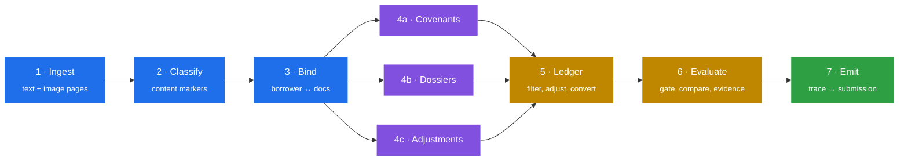

<div align="center">

# Halyk AI Covenant Agent

**Reads an archive of corporate loan documents and a transaction ledger, then decides for every covenant of every borrower whether it is met.**


</div>

<table>
<tr><td width="33%" valign="top">

**The model extracts, the code decides**

Verbatim spans only. Every comparison and ratio in Python over `Decimal`. No verdict passes through a model.

</td><td width="33%" valign="top">

**Three reading modalities**

Text layers, image pages inside textual documents, full scans — detected **per page**. Per document loses content silently.

</td><td width="33%" valign="top">

**Nothing fails quietly**

Failures are contained per clause and per document. One unreadable covenant costs one cell, never the run.

</td></tr>
</table>

---

## Quick start

```bash
git clone <repo-url> && cd covenant-agent
python -m venv .venv && source .venv/bin/activate     # Windows: .venv\Scripts\activate
pip install -e .
cp .env.example .env                                  # add your API key
```

The input directory must contain `documents/`, the ledger CSV, and `submission_template.json`.

**Inspect before spending.** Preflight runs stages 1–3 and makes no API calls:

```bash
python -m agent preflight --input data/private
```

**Then the run.** One command produces the submission:

```bash
python -m agent --input data/private --out submission.json
```

> There is no manual step anywhere in the pipeline and no path through the code where an answer can be entered by hand.

Provider is one environment variable — `LLM_PROVIDER=openai` or `anthropic`, no code change. Stages skip when their artifact exists, so deleting `04a_covenants.json` re-extracts covenants without repeating two minutes of PDF parsing.

```bash
python eval/score.py submission.json eval/ground_truth.json    # score against a key
python eval/diagnose.py submission.json --cell P5/6.1          # why one cell is wrong
```

`diagnose --cell` prints every ledger row that entered each leg with the reason it was included, the derived terms, and the comparison.

---

## How it works



Each stage reads one artifact and writes the next.

| Artifact | Holds |
|---|---|
| `01_inventory.json` | text per page, rendered image pages, unreadable files |
| `02_classified.json` | document type, account ids — filenames are opaque hashes |
| `03_bound.json` | borrower → its documents, resolved through the ledger |
| `04a_covenants.json` | thresholds, direction, metric shapes, springing conditions |
| `04b_parties.json` | ownership and pledged-asset tables with the rule beneath each |
| `04c_adjustments.json` | eight kinds of auditor adjustment, from text and image pages |
| `05_ledger.parquet` | filtered by account, adjusted in order, converted to one currency |
| `06_evaluated.json` | verdicts, full-precision values, counterfactual evidence |
| `trace.json` → `submission.json` | evidence trace and its pure projection |

> `submission.json` is a pure function of `trace.json` — a formatting change is a one-function edit, not another run.

---

## Architecture

| Layer | Stack |
|---|---|
| Documents | `pdfplumber` · `PyMuPDF` |
| Extraction | `instructor` · `pydantic` |
| Vision | provider-native, same schema as text |
| Ledger | `pandas` · `duckdb` · `Decimal` |
| Providers | `openai` · `anthropic` |

### Document layer

`pdfplumber` returns the text, `PyMuPDF.search_for` locates it. The model is asked for the printed wording and never for coordinates, so coordinates cannot be hallucinated — and a span that is not a substring of its page is rejected before it reaches the ledger.

### No retrieval layer, deliberately

Two hundred documents is not a retrieval problem. Similarity is the wrong tool where a superseded contract differs from its replacement by one header line, and it would add run-to-run variance in the one decision — which document a borrower is bound to — where variance is most expensive.

### Vision, only where the text layer ends

Not a general OCR problem: the content on image pages is tabular, and layout carries meaning that character recognition discards. Detection is per page, because a five-page audit file can hold two thousand characters on page one and two image-only pages in the middle.

### Extraction layer

The Pydantic schema is the contract. Fields that carry no score are optional with defaults so a missing quote never blocks an extraction; fields that decide an answer are required, because a silently defaulted threshold produces a confident wrong verdict.

### Ledger layer

Adjustments apply in a fixed order — amounts filled, rows excluded, reclassified, converted, then off-ledger disclosures appended. Filling amounts last leaves a row invisible to every aggregate that already ran.

### Determinism and cost

`temperature=0`, fixed seed, pinned model, disk cache keyed on provider, model and prompt — a repeated run makes no network calls. Throughput is governed by a token bucket rather than a semaphore, because a concurrency limit cannot respect a tokens-per-minute ceiling and dropped calls are invisible: the run finishes, reports success, and quietly extracted less than it should.

### Observability without an answer key

Each stage reports counters that indicate extraction health independently of correctness — empty legs, unstable fields, retried clauses, breach share, distinct adjustment kinds found.

> Extraction variance across cold runs is roughly an order of magnitude larger than the effect of any single engine change. The final submission is selected from several extractions by these counters, not by a single pass.

---

## Results

Measured on the public dataset against the provided answer key.

| | |
|---|---|
| **Score** | **34.94 / 36.00** |
| Status accuracy | 35 / 36 |
| Ceiling | 35.00 — one cell is unreachable, its source contract states a threshold contradicting the key |
| Runtime, cold cache | ~15 min · ingest 105 s, classification 63 s, remainder extraction |
| Cost per run | ~$0.15 on `gpt-4o-mini` |

---

## Requirements

Python 3.11 or later, an API key for either provider, no GPU.

<details>
<summary><b>pyproject.toml</b></summary>

```toml
[build-system]
requires = ["setuptools>=61"]
build-backend = "setuptools.build_meta"

[project]
name = "covenant-agent"
version = "0.1.0"
description = "Bank covenant checking agent"
requires-python = ">=3.11"
dependencies = [
    "pdfplumber",
    "pymupdf",
    "duckdb",
    "pandas",
    "pydantic",
    "instructor",
    "openai",
    "anthropic",
    "python-dotenv",
    "pytest",
]

[project.scripts]
covenant = "agent.cli:main"

[tool.setuptools.packages.find]
where = ["."]
include = ["agent*"]

[tool.pytest.ini_options]
testpaths = ["tests"]
pythonpath = ["."]
```

</details>

```ini
# .env
LLM_PROVIDER=openai          # or anthropic
OPENAI_API_KEY=...
ANTHROPIC_API_KEY=...
```

---

## Project layout

```
agent/
  __main__.py        orchestrator, artifact resumption, deadline guard
  cli.py             run / preflight / score / validate
  config.py          provider, model id, limits, contact fields
  models.py          domain model, Decimal throughout
  stages/            s1_ingest … s7_emit
  parsing/           pdf, numbers, tables, entity names, categories
  metrics/           leg construction, derived shapes, comparison
  llm/               cached client, token bucket, vision path, schemas
  evidence/          quote verification, counterfactual search
  trace.py           evidence trace and its self-verification
  validate.py        output invariants
eval/
  score.py           scoring function, per-component and per-slot report
  diagnose.py        failure attribution, per-cell leg breakdown
tests/
```

---

## Testing

```bash
pytest tests/ -q
```

The robustness suite builds mutated copies of the dataset — a missing dossier, an extra scenario, an unknown slot, an unmarked PDF, a blanked amount, a duplicated contract — and asserts each completes, fills every template cell, and records the expected conflict. LLM responses replay from recorded fixtures, so the suite runs offline in seconds and a live call during a test raises rather than silently succeeding.

---

## Compliance

Code in this repository was authored with the assistance of Cursor. Every answer in `submission.json` is produced by the pipeline in this repository, executed as the single command shown above against the competition dataset. No answer was obtained from an interactive agent and none was entered by hand. The run manifest records the git SHA, dataset hash and model versions, so any submission can be reproduced and checked against the code that generated it.

---

## What the case is actually testing

**The answer format is a regulator exam.** Verdict, figure, transaction is exactly what an examiner asks when they pick a borrower at random and ask the bank to walk the last covenant cycle.

**The traps are real failure modes, not puzzles.** Superseded editions differing by period rather than threshold, reclassifications that change both sides of a ratio, obligations disclosed in prose and never posted, a working paper that reads authoritatively and declares in its own text that it carries no verified figures.

**Clause numbering carries no meaning.** The same paragraph number is a different covenant for each borrower, and thresholds are stated per borrower — including the ownership percentage above which a counterparty becomes a related party. Near-miss entities sit deliberately just below that line, and in one case the entity below it transacts ten times more than the one above, so a single misclassification does not degrade the answer — it inverts it.

> Two details reward reading the documents rather than the data. Related-party payments appear as ordinary consulting fees, so counterparty identity from the compliance dossier is the only signal. And the verdict is decided on the unrounded value while the reported figure is rounded — two cells share a threshold and a rounded actual yet have opposite verdicts.

---

<div align="center">

## Team

**macintosh** · Halyk AI Challenge 2026

*Three days were spent reading the archive before writing the pipeline that consumes it.*
*The traps in this dataset are not visible from the ledger, and a system designed against*
*the CSV alone converges on answers that are internally consistent and wrong.*

</div>
